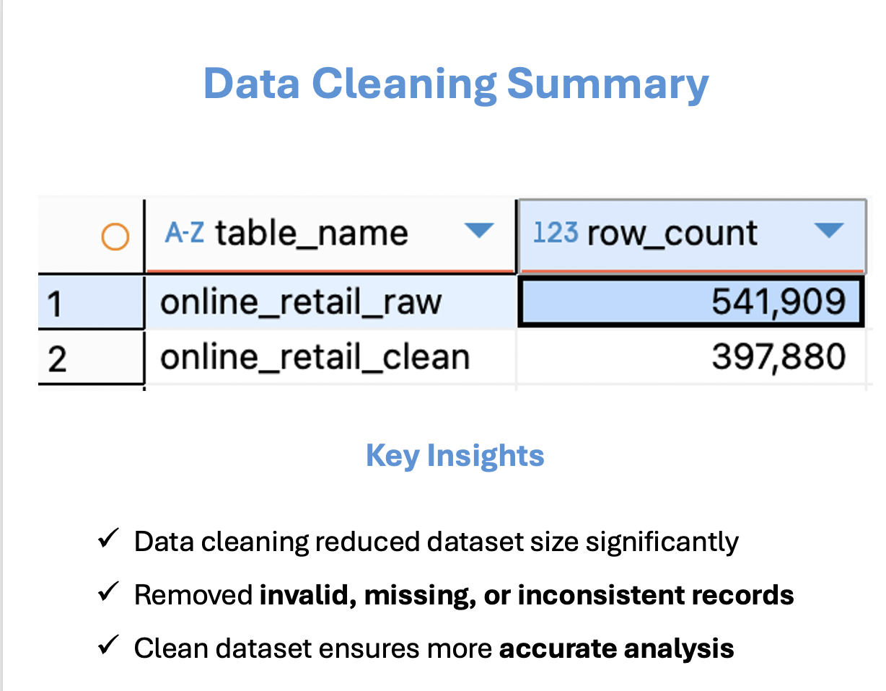
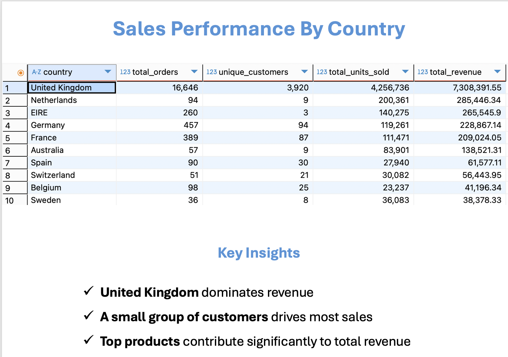
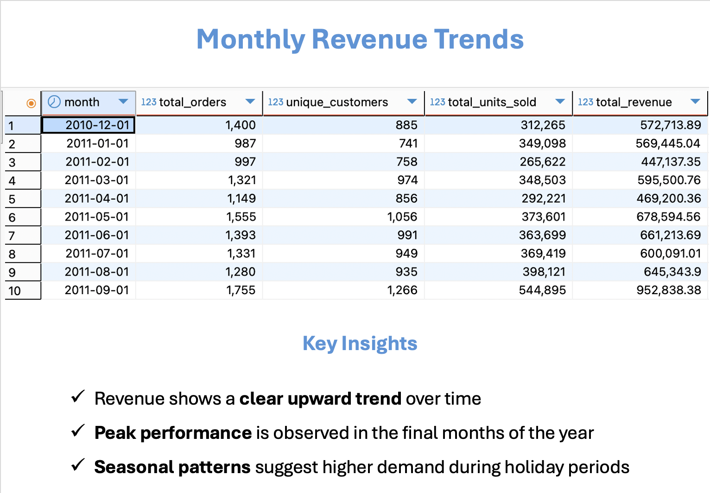
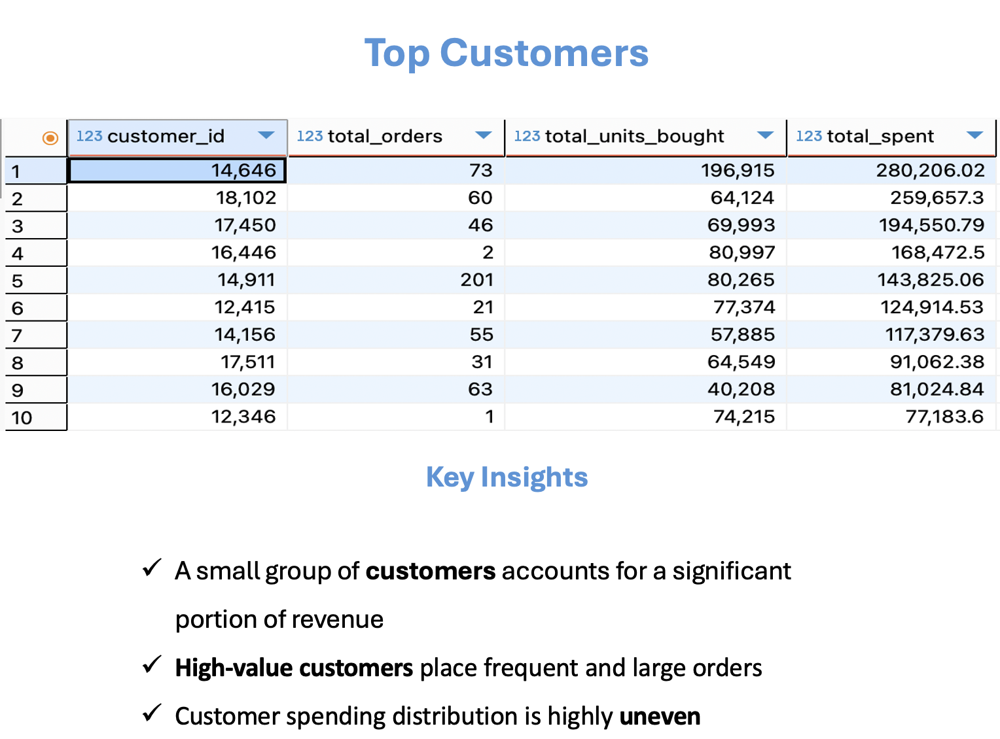
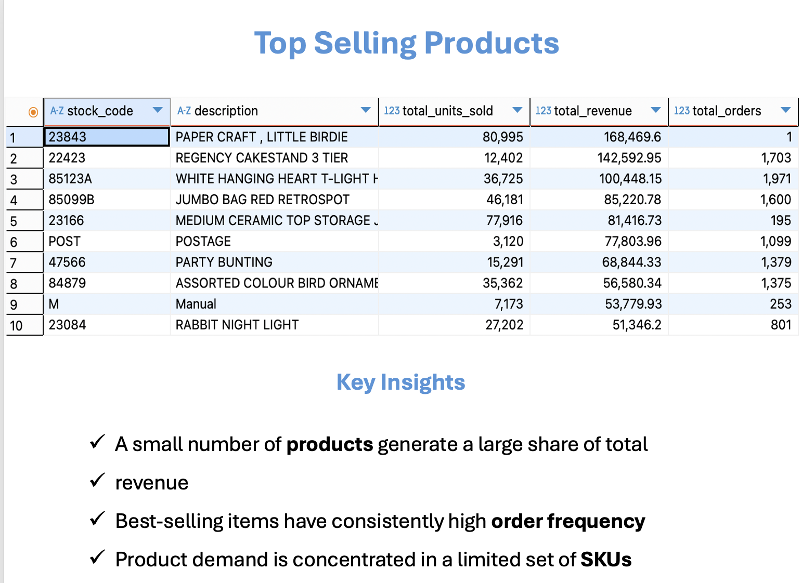

# 📊 SQL Data Analysis Project – Online Retail Dataset

This project analyzes transactional retail data using SQL to uncover insights about sales performance, customer behavior, and product trends.

---

## 🎯 Project Objective
The objective of this project is to clean raw data and transform it into structured datasets that enable accurate analysis and business decision-making.

---

## 🧹 Data Cleaning
- Removed invalid, missing, and inconsistent records  
- Reduced dataset size from **541,909 → 397,880 rows**  
- Ensured data quality for reliable analysis  

---

## 🌍 Sales Performance by Country
- Aggregated orders, customers, and revenue by country  
- Identified top-performing markets  

---

## 📅 Monthly Revenue Trends
- Analyzed revenue trends over time  
- Identified growth patterns and seasonal behavior  

---

## 👥 Top Customers Analysis
- Identified high-value customers  
- Analyzed purchase frequency and spending behavior  

---

## 🛍️ Top Selling Products
- Determined best-performing products by revenue and volume  
- Highlighted key contributors to total sales  

---

## 🛠️ Tools & Technologies
- SQL (PostgreSQL)  
- Data Cleaning & Transformation  
- Aggregation & Analytical Queries  

---

## 📈 Key Insights
- A small number of customers generate a large share of revenue  
- Sales are concentrated in a few key countries  
- Revenue shows a clear upward trend over time  
- A limited number of products drive most sales  

---

## 📎 SQL Code
All queries used for data cleaning and analysis are included in this repository (`online_retail.sql`).
